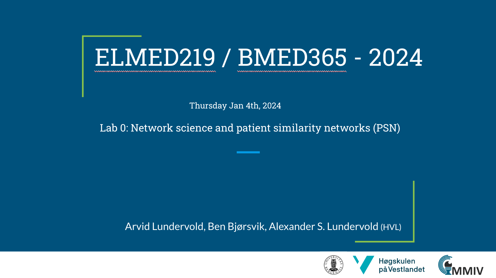

# Lab 0: Introduction to theory and tools for machine learning

This lab will give a quick example-based introduction to basic ideas in **machine learning**, using Python and *scikit-learn*.   We will also introduce elements of **graph theory**, **network science**, and the concept of **patient similarity networks** (PSN) using *NetworkX* - a Python package for the creation, manipulation, and study of the structure, dynamics, and functions of complex networks.

## Slides

## Other resources on Graphs and Networks
A. Lundervold \& the Medical AI Assistant: _Elements of graph theory and patient similarity networks (PSN) - A short introduction for ELMED219+BMED365_ [[PDF](./assets/ELMED219_BMED365_2024_PSN.pdf)] [[$\LaTeX$](https://www.overleaf.com/read/pccnktqbnswg#4f47e2)]

For medical and biomedical students new to graph theory, the following online tutorials and resources provide a gentle introduction:

- **Khan Academy Introduction to Graph Theory:** A beginner-friendly series covering basic concepts and applications. [Khan Academy Graph Theory](https://www.khanacademy.org/computing/computer-science/algorithms/graph-representation/a/describing-graphs)
    
- **Graph Theory Tutorials by Sarada Herke:** A YouTube playlist offering visual and intuitive explanations of graph theory concepts. [Sarada Herke's Graph Theory Tutorials](https://www.youtube.com/playlist?list=PLoJC20gNfC2gmT_5WgwYwGMvgCjYVsIQg)
    
- **Introduction to Graph Theory from University of Waterloo:** Detailed course notes suitable for those seeking a more academic approach. [University of Waterloo Graph Theory](https://www.cemc.uwaterloo.ca/events/mathcircles/2016-17/Winter/Senior_Mar22.pdf)

<!-- Here's a short extra video that goes through a very similar notebook to the one we use in this lab: https://www.youtube.com/watch?v=OhxUgFNnj1U. You may want to watch this as well. -->

## Jupyter notebooks

:question: As Jupyter Notebook is quite new to many of you, you may want to skim through some tutorials. Here are two (also linked under "Getting Started" at MittUiB): 
* https://jupyter-notebook-beginner-guide.readthedocs.io/en/latest/index.html
* https://www.datacamp.com/community/tutorials/tutorial-jupyter-notebook

| Notebook    |      1-Click Notebook     
|:----------|------|
|  [Lab0-01-simple-examples.ipynb](https://nbviewer.org/github/MMIV-ML/ELMED219/blob/main/Lab0-ML/Lab0-01-simple-examples.ipynb)   Constructs predictive models based on some simple data sets. Provides a hands-on introduction to some basic ingredients and techniques in ML. |  

## Your turn! 

Spend some time playing around with the provided examples. You'll find some questions for you to investigate in the notebook. If you're already familiar with machine learning, you can try your hand at more advanced examples or, even better, help out other less experienced team members. Try out the things you learn in the DataCamp courses by modifying and extending the notebook used in this Lab.

 
If you have a subscription to [ChatGPT Plus](https://openai.com/blog/chatgpt-plus), you can also try out the the [**Medical AI Assistant (UiBmed - ELMED219 & BMED365)**](https://chat.openai.com/g/g-d90dfN17H-medical-ai-assistant-uibmed-elmed219-bmed365) and see if you can get it to answer some of your questions.
