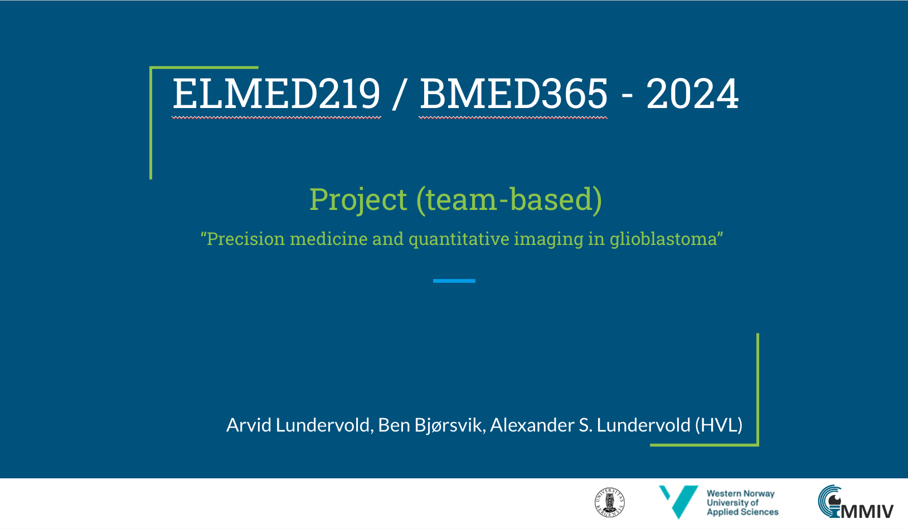
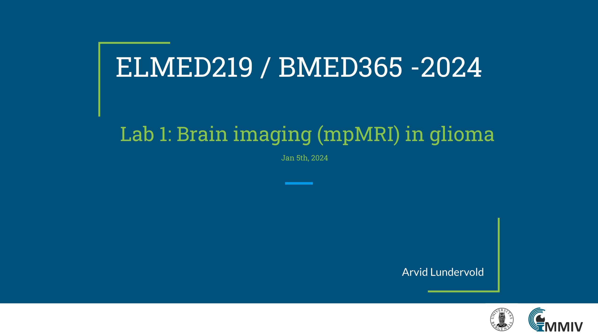

# Lab 1: Brain imaging (mpMRI) in glioma

This lab will give an example-based introduction to multiparametric Magnetic Resonance Imaging (mpMRI) of brain tumor (glioma), using Python and toolkits for computational medical imaging and analysis.

## Slides

<!-- Here's a short extra video that goes through a very similar notebook to the one we use in this lab: https://www.youtube.com/watch?v=OhxUgFNnj1U. You may want to watch this as well. -->

The following notebook is essentially a copy of the multi-class semantic segmentation notebook `10d_tutorial_multiclass_segmentation.ipynb` from [`fastMONAI`](https://fastmonai.no) (developed by Satheshkumar Kaliyugarasan and Alexander S. Lundervold at [MMIV](https://mmiv.no/machinelearning)), and also incoporating parts of the extended notebook in https://github.com/MMIV-ML/fastMONAI/tree/master/presentations/MMIV-1022. We will not have time for a detailed introduction to MONAI. Please consult the documentation: https://monai.io and also see their tutorials.

| Notebook    |      1-Click Notebook      |
|:----------|------|
|  [Lab1-1-BRATS-3D-fastMONAI-extended.ipynb](https://nbviewer.jupyter.org/github/MMIV-ML/ELMED219/blob/main/Lab1-mpMRI-glioma/Lab1-1-BRATS-3D-fastMONAI-extended.ipynb)  Multi-class semantic segmentation of a glioma from mpMRI recordings  *If on Colab*: Remember to attach a GPU to your Colab Runtime: 1. From the **Runtime** menu select **Change Runtime Type** 2. Choose **GPU** (T4 GPU) from the drop-down menu 3. Click **'SAVE'** (~3 min to install fastMONAI with GPU attached) | |

### Going deeper (wider)?
Some additional (optional) example-based introductions to (bio)medical imaging is in [Lab-optional-imganing](./Lab-optional-imaging)

| Notebook    |      1-Click Notebook      |
|:----------|------|
|  [01-imaging-intro.ipynb](https://nbviewer.jupyter.org/github/MMIV-ML/ELMED219/blob/main/Lab1-mpMRI-glioma/Lab-optional-imaging/01-imaging-intro.ipynb)  Illustration of basic concepts and methods in imaging   | |
|  [02-mri-intro.ipynb](https://nbviewer.jupyter.org/github/MMIV-ML/ELMED219/blob/main/Lab1-mpMRI-glioma/Lab-optional-imaging/02-mri-intro.ipynb)  Introduction to Magnetic Resonance Imaging   | |
|  [03-imc-intro.ipynb](https://nbviewer.jupyter.org/github/MMIV-ML/ELMED219/blob/main/Lab1-mpMRI-glioma/Lab-optional-imaging/03-imc-intro.ipynb)  Introduction to Imaging Mass Cytometry   | |

---

## Your turn!

Spend some time playing around with the provided examples. You'll find some questions for you to investigate in the notebooks. If you're already familiar with medical imaging and image analysis you can try your hand at more advanced examples, or, even better, help out other less experienced team members.

#### Jupyter notebooks

:question: As Jupyter Notebook is quite new to many of you, you may want to skim through some tutorials. Here are two (also linked under "Getting Started" at MittUiB):
* https://jupyter-notebook-beginner-guide.readthedocs.io/en/latest/index.html
* https://www.datacamp.com/community/tutorials/tutorial-jupyter-notebook

