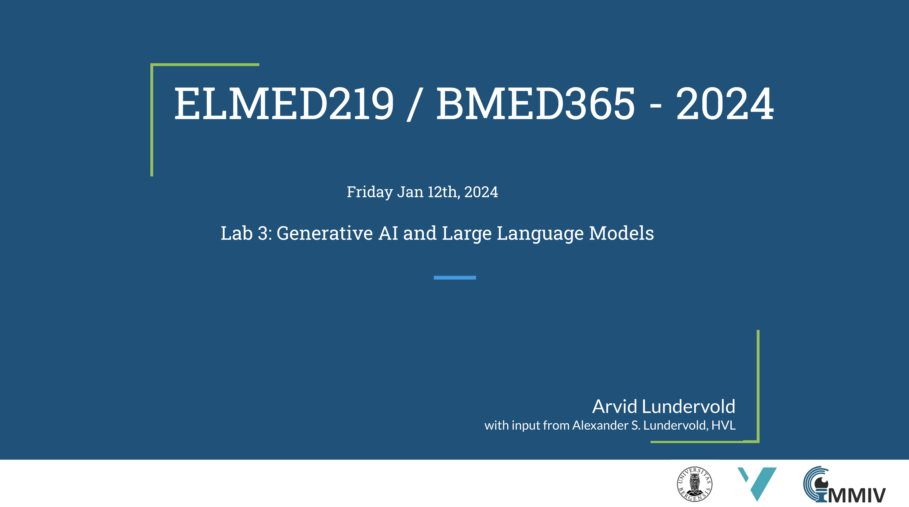

# Lab 3: Generative AI and Large Language Models

This lab is part of our journey through computational modeling techniques and AI in biomedical and clinical applications. It is designed to give you a comprehensive understanding of how generative AI is transforming society in general and healthcare in particular and the role it will play in the future of medicine.   _update: 2023-12-04_

<!--   -->
 
If you have a subscription to [ChatGPT Plus](https://openai.com/blog/chatgpt-plus), you can also try out the the [**Medical AI Assistant (UiBmed - ELMED219 & BMED365)**](https://chat.openai.com/g/g-d90dfN17H-medical-ai-assistant-uibmed-elmed219-bmed365) [GPT](https://openai.com/blog/introducing-gpts) and see if you can get it to answer some of your questions.

## Learning motivations - watch these
(in the order of duration ...)

- _Foundation Models: An Explainer for Non-Experts_ by [**Stanford HAI**](https://crfm.stanford.edu) [[link](https://youtu.be/kK3NmQT241w)] (2:08 min)
   - see also Stanford Center for Research on Foundation Models [code](https://github.com/stanford-crfm)
   - and get informed and be inspired by [Azeem Azhar](https://www.linkedin.com/in/azhar/?originalSubdomain=uk)’s 2020 conversation with the pioneering AI scientist [Fei-Fei Li](https://en.wikipedia.org/wiki/Fei-Fei_Li), professor of computer science at Stanford University and the founding co-director of Stanford’s Human-Centered AI Institute [[link](https://hbr.org/podcast/2023/11/azeems-picks-the-promise-of-ai-with-fei-fei-li)] (37:46 min)

- _The Exciting, Perilous Journey Toward AGI_, **TED talk** by [Ilya Sutskever](https://en.wikipedia.org/wiki/Ilya_Sutskever) (OpenAI) [[link](https://www.youtube.com/watch?v=SEkGLj0bwAU)] (12:25 min)

- _Introduction to large language models_ by [John Ewald](https://www.linkedin.com/in/ewaldjohn) Google Cloud Tech [[link](https://www.youtube.com/watch?v=zizonToFXDs)] (15:45 min)

- _Large Language Models for Health 101_ by [Nigam Shah](https://profiles.stanford.edu/nigam-shah),  **Stanford HAI**  [[link](https://www.youtube.com/watch?v=b88FZYNJdIk)] (16:44 min)
  - see also his "A framework for shaping the future of AI in health care" [[link](https://shahlab.stanford.edu)]
  
- _Introduction to Generative AI_ by [Gwendolyn Stripling](https://www.linkedin.com/in/gwendolyn-stripling)  Google Cloud Tech [[link](https://www.youtube.com/watch?v=G2fqAlgmoPo)]   (22:07 min)
  - see also her [_Low-code AI_](https://www.amazon.com/dp/1098146824/ref=tsm_1_fb_lk) book with [code](https://github.com/maabel0712/low-code-ai)

- _Intro to Large Language Models_ by [Andrej Karpathy](https://en.wikipedia.org/wiki/Andrej_Karpathy) [[link](https://www.youtube.com/watch?v=zjkBMFhNj_g)] (59:47 min)

  - Slides as PDF [[link](https://drive.google.com/file/d/1pxx_ZI7O-Nwl7ZLNk5hI3WzAsTLwvNU7/view)] (42MB)
  - Slides as Keynote [[link](https://drive.google.com/file/d/1FPUpFMiCkMRKPFjhi9MAhby68MHVqe8u/view)] (140MB)
  - The repo: https://github.com/karpathy
 
- _Large Language Models and The End of Programming_, CS50 Tech Talk with [Matt Welsh](https://en.wikipedia.org/wiki/Matt_Welsh_\(computer_scientist\)) [[link](https://www.youtube.com/watch?v=JhCl-GeT4jw)]  (66:55 min)
  - [CS50](https://www.edx.org/cs50) is Harvard University's introduction to the intellectual enterprises of computer science and the art of programming

## Slides

<!--

-->

<!-- Here's a short extra video that goes through a very similar notebook to the one we use in this lab: https://www.youtube.com/watch?v=OhxUgFNnj1U. You may want to watch this as well. -->

-----
### Other sources of inspiration:

- [PCBBE 2023](https://pcbbe.p.lodz.pl) "Will AI be going to replace a medical doctor?" [[link](https://github.com/arvidl/PCBBE-2023-explore/blob/main/PCBBE_2023-PLEN-04-Debate-AL.md)]
